# RsDragonflyDB — Architecture Diagrams

All diagrams use Mermaid and render natively in GitHub, GitLab, and most Markdown previewers.

---

## Table of Contents

1. [C4 Context — System Boundary](#1-c4-context--system-boundary)
2. [C4 Component — Internal Structure](#2-c4-component--internal-structure)
3. [Thread & Channel Map](#3-thread--channel-map)
4. [Class Diagram — Core Data Model](#4-class-diagram--core-data-model)
5. [Key Routing Algorithm](#5-key-routing-algorithm)
6. [Sequence — SET Command End-to-End](#6-sequence--set-command-end-to-end)
7. [Sequence — RESP2 Parsing Pipeline](#7-sequence--resp2-parsing-pipeline)
8. [Sequence — Multi-Key DEL Fan-Out](#8-sequence--multi-key-del-fan-out)
9. [Sequence — Server Startup & Graceful Shutdown](#9-sequence--server-startup--graceful-shutdown)
10. [State — Shard Worker Event Loop](#10-state--shard-worker-event-loop)
11. [Flowchart — TTL Expiration (Lazy + Active)](#11-flowchart--ttl-expiration-lazy--active)
12. [Snapshot Binary Format — RSDF](#12-snapshot-binary-format--rsdf)
13. [Sequence — GET with Lazy Expiry](#13-sequence--get-with-lazy-expiry)
14. [Flowchart — Connection Task Internals](#14-flowchart--connection-task-internals)
15. [Flowchart — Error Propagation Paths](#15-flowchart--error-propagation-paths)
16. [Flowchart — Memory Accounting per SET](#16-flowchart--memory-accounting-per-set)
17. [Sequence — Snapshot Load on Startup](#17-sequence--snapshot-load-on-startup)
18. [Flowchart — Backpressure Cascade](#18-flowchart--backpressure-cascade)
19. [Flowchart — Metrics Aggregation to Prometheus](#19-flowchart--metrics-aggregation-to-prometheus)
20. [Flowchart — Module Dependency Graph](#20-flowchart--module-dependency-graph)

---

## 1. C4 Context — System Boundary

High-level view: who talks to RsDragonflyDB and how.

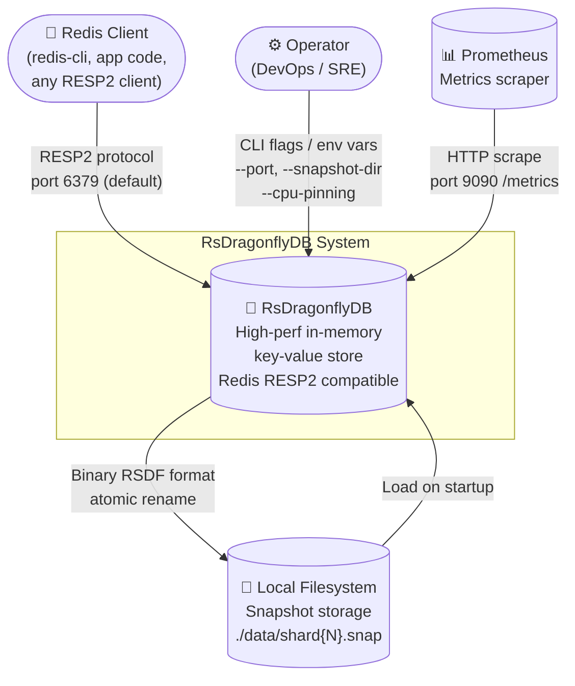
```mermaid
flowchart TB
    Client(["👤 Redis Client\n(redis-cli, app code,\nany RESP2 client)"])
    Ops(["⚙️ Operator\n(DevOps / SRE)"])

    subgraph boundary["RsDragonflyDB System"]
        Core[("🐉 RsDragonflyDB\nHigh-perf in-memory\nkey-value store\nRedis RESP2 compatible")]
    end

    Prometheus[("📊 Prometheus\nMetrics scraper")]
    FS[("💾 Local Filesystem\nSnapshot storage\n./data/shard{N}.snap")]

    Client -- "RESP2 protocol\nport 6379 (default)" --> Core
    Ops -- "CLI flags / env vars\n--port, --snapshot-dir\n--cpu-pinning" --> Core
    Prometheus -- "HTTP scrape\nport 9090 /metrics" --> Core
    Core -- "Binary RSDF format\natomic rename" --> FS
    FS -- "Load on startup" --> Core
```

---

## 2. C4 Component — Internal Structure

All crates and modules and how they wire together inside a single binary.

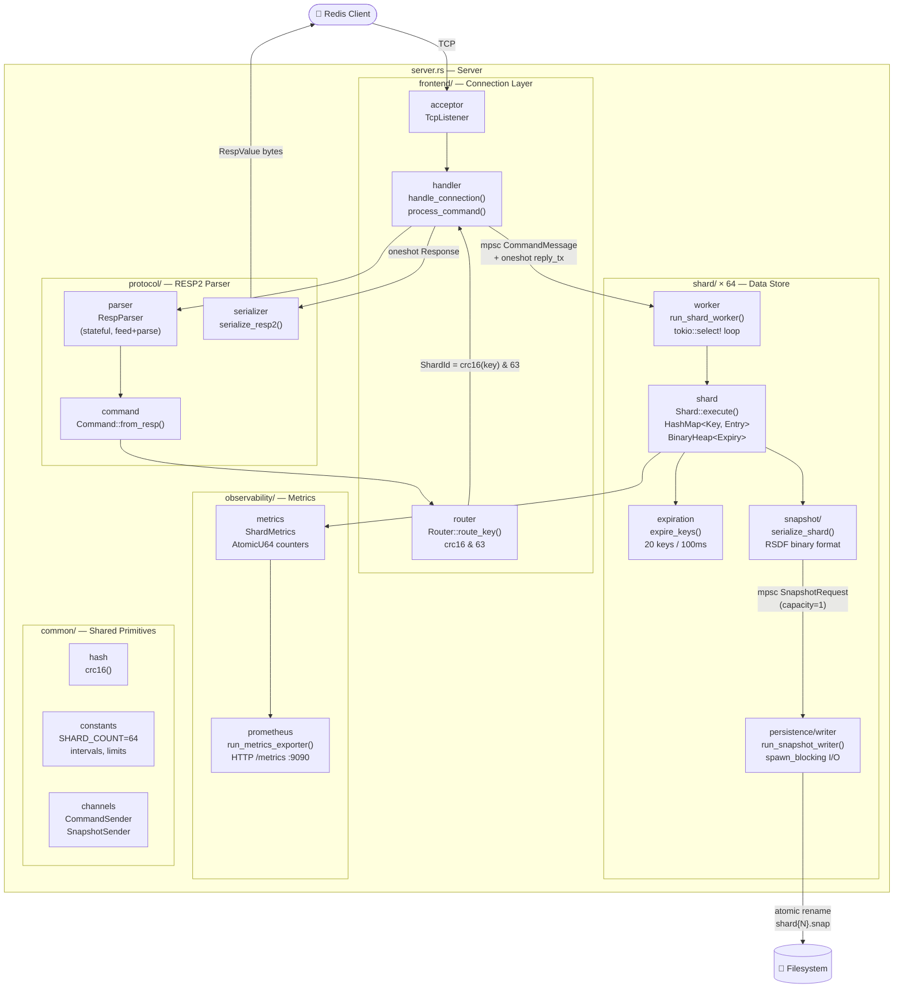
```mermaid
flowchart TB
    Client(["👤 Redis Client"])

    subgraph server["server.rs — Server"]
        direction TB

        subgraph frontend["frontend/ — Connection Layer"]
            direction LR
            Acceptor["acceptor\nTcpListener"]
            Handler["handler\nhandle_connection()\nprocess_command()"]
            Router["router\nRouter::route_key()\ncrc16 & 63"]
        end

        subgraph protocol["protocol/ — RESP2 Parser"]
            direction LR
            Parser["parser\nRespParser\n(stateful, feed+parse)"]
            CmdParse["command\nCommand::from_resp()"]
            Serializer["serializer\nserialize_resp2()"]
        end

        subgraph shards["shard/ × 64 — Data Store"]
            direction TB
            Worker["worker\nrun_shard_worker()\ntokio::select! loop"]
            ShardCore["shard\nShard::execute()\nHashMap&lt;Key, Entry&gt;\nBinaryHeap&lt;Expiry&gt;"]
            Expiry["expiration\nexpire_keys()\n20 keys / 100ms"]
            Snapshot["snapshot/\nserialize_shard()\nRSDF binary format"]
            Writer["persistence/writer\nrun_snapshot_writer()\nspawn_blocking I/O"]
        end

        subgraph observability["observability/ — Metrics"]
            Metrics["metrics\nShardMetrics\nAtomicU64 counters"]
            Prom["prometheus\nrun_metrics_exporter()\nHTTP /metrics :9090"]
        end

        subgraph common["common/ — Shared Primitives"]
            direction LR
            Hash["hash\ncrc16()"]
            Constants["constants\nSHARD_COUNT=64\nintervals, limits"]
            Channels["channels\nCommandSender\nSnapshotSender"]
        end
    end

    Client -- "TCP" --> Acceptor
    Acceptor --> Handler
    Handler --> Parser
    Parser --> CmdParse
    CmdParse --> Router
    Router -- "ShardId = crc16(key) & 63" --> Handler
    Handler -- "mpsc CommandMessage\n+ oneshot reply_tx" --> Worker
    Worker --> ShardCore
    ShardCore --> Expiry
    ShardCore --> Snapshot
    Snapshot -- "mpsc SnapshotRequest\n(capacity=1)" --> Writer
    Writer -- "atomic rename\nshard{N}.snap" --> FS[("💾 Filesystem")]
    ShardCore --> Metrics
    Metrics --> Prom
    Handler -- "oneshot Response" --> Serializer
    Serializer -- "RespValue bytes" --> Client
```

---

## 3. Thread & Channel Map

Every concurrent actor and the channels connecting them.
Each box is a separate tokio task (or OS thread for `spawn_blocking`).

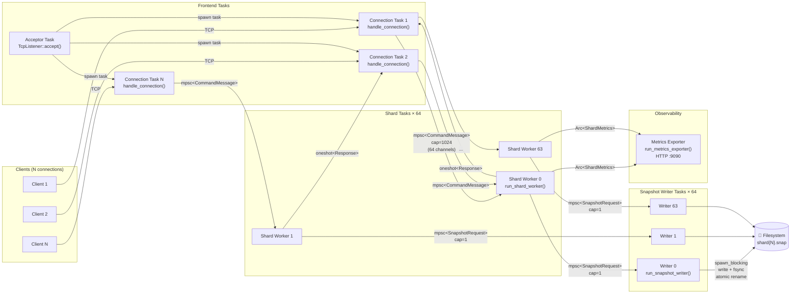
```mermaid
flowchart LR
    subgraph clients["Clients (N connections)"]
        C1["Client 1"]
        C2["Client 2"]
        CN["Client N"]
    end

    subgraph frontend["Frontend Tasks"]
        Acc["Acceptor Task\nTcpListener::accept()"]
        H1["Connection Task 1\nhandle_connection()"]
        H2["Connection Task 2\nhandle_connection()"]
        HN["Connection Task N\nhandle_connection()"]
    end

    subgraph shardtasks["Shard Tasks × 64"]
        direction TB
        SW0["Shard Worker 0\nrun_shard_worker()"]
        SW1["Shard Worker 1"]
        SWN["Shard Worker 63"]
    end

    subgraph writertasks["Snapshot Writer Tasks × 64"]
        direction TB
        WR0["Writer 0\nrun_snapshot_writer()"]
        WR1["Writer 1"]
        WRN["Writer 63"]
    end

    subgraph obs["Observability"]
        ME["Metrics Exporter\nrun_metrics_exporter()\nHTTP :9090"]
    end

    FS[("💾 Filesystem\nshard{N}.snap")]

    C1 -- TCP --> H1
    C2 -- TCP --> H2
    CN -- TCP --> HN
    Acc -- "spawn task" --> H1
    Acc -- "spawn task" --> H2
    Acc -- "spawn task" --> HN

    H1 -- "mpsc&lt;CommandMessage&gt;\ncap=1024\n(64 channels)" --> SW0
    H1 -- "..." --> SWN
    H2 -- "mpsc&lt;CommandMessage&gt;" --> SW0
    HN -- "mpsc&lt;CommandMessage&gt;" --> SW1

    SW0 -- "oneshot&lt;Response&gt;" --> H1
    SW1 -- "oneshot&lt;Response&gt;" --> H2

    SW0 -- "mpsc&lt;SnapshotRequest&gt;\ncap=1" --> WR0
    SW1 -- "mpsc&lt;SnapshotRequest&gt;\ncap=1" --> WR1
    SWN -- "mpsc&lt;SnapshotRequest&gt;\ncap=1" --> WRN

    WR0 -- "spawn_blocking\nwrite + fsync\natomic rename" --> FS
    WR1 --> FS
    WRN --> FS

    SW0 -- "Arc&lt;ShardMetrics&gt;" --> ME
    SWN -- "Arc&lt;ShardMetrics&gt;" --> ME
```

---

## 4. Class Diagram — Core Data Model

Key structs, their fields, and relationships.

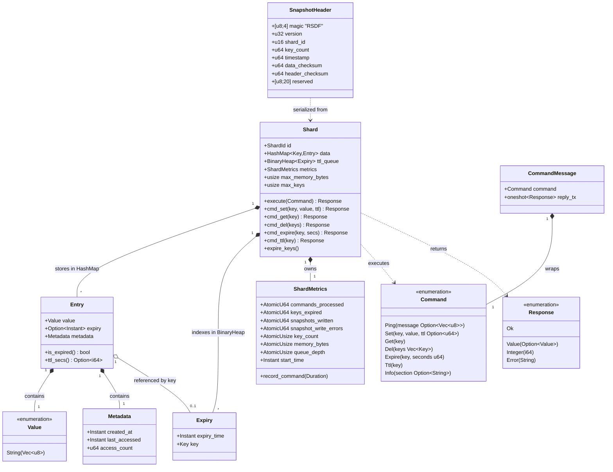
```mermaid
classDiagram
    class Shard {
        +ShardId id
        +HashMap~Key,Entry~ data
        +BinaryHeap~Expiry~ ttl_queue
        +ShardMetrics metrics
        +usize max_memory_bytes
        +usize max_keys
        +execute(Command) Response
        +cmd_set(key, value, ttl) Response
        +cmd_get(key) Response
        +cmd_del(keys) Response
        +cmd_expire(key, secs) Response
        +cmd_ttl(key) Response
        +expire_keys()
    }

    class Entry {
        +Value value
        +Option~Instant~ expiry
        +Metadata metadata
        +is_expired() bool
        +ttl_secs() Option~i64~
    }

    class Value {
        <<enumeration>>
        String(Vec~u8~)
    }

    class Expiry {
        +Instant expiry_time
        +Key key
    }

    class Metadata {
        +Instant created_at
        +Instant last_accessed
        +u64 access_count
    }

    class ShardMetrics {
        +AtomicU64 commands_processed
        +AtomicU64 keys_expired
        +AtomicU64 snapshots_written
        +AtomicU64 snapshot_write_errors
        +AtomicUsize key_count
        +AtomicUsize memory_bytes
        +AtomicUsize queue_depth
        +Instant start_time
        +record_command(Duration)
    }

    class Command {
        <<enumeration>>
        Ping(message Option~Vec~u8~~)
        Set(key, value, ttl Option~u64~)
        Get(key)
        Del(keys Vec~Key~)
        Expire(key, seconds u64)
        Ttl(key)
        Info(section Option~String~)
    }

    class Response {
        <<enumeration>>
        Value(Option~Value~)
        Integer(i64)
        Ok
        Error(String)
    }

    class CommandMessage {
        +Command command
        +oneshot~Response~ reply_tx
    }

    class SnapshotHeader {
        +[u8;4] magic  "RSDF"
        +u32 version
        +u16 shard_id
        +u64 key_count
        +u64 timestamp
        +u64 data_checksum
        +u64 header_checksum
        +[u8;20] reserved
    }

    Shard "1" *-- "*" Entry : stores in HashMap
    Shard "1" *-- "*" Expiry : indexes in BinaryHeap
    Shard "1" *-- "1" ShardMetrics : owns
    Entry "1" *-- "1" Value : contains
    Entry "1" *-- "1" Metadata : contains
    Entry "1" o-- "0..1" Expiry : referenced by key
    CommandMessage "1" *-- "1" Command : wraps
    Shard ..> Command : executes
    Shard ..> Response : returns
    SnapshotHeader ..> Shard : serialized from
```

---

## 5. Key Routing Algorithm

How any key maps deterministically to exactly one shard.

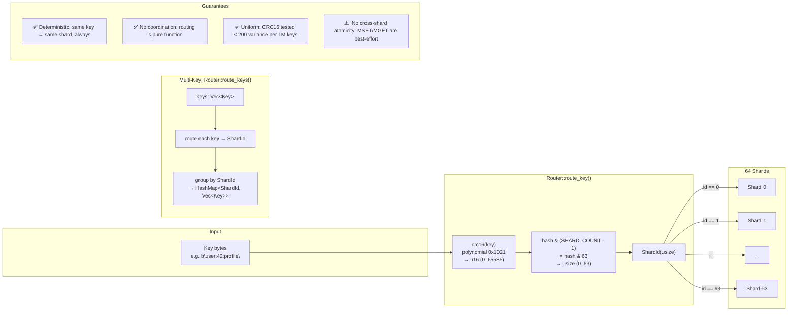
```mermaid
flowchart LR
    subgraph input["Input"]
        K["Key bytes\ne.g. b\"user:42:profile\""]
    end

    subgraph routing["Router::route_key()"]
        direction TB
        H["crc16(key)\npolynomial 0x1021\n→ u16 (0–65535)"]
        M["hash & (SHARD_COUNT - 1)\n= hash & 63\n→ usize (0–63)"]
        ID["ShardId(usize)"]
    end

    subgraph shards["64 Shards"]
        S0["Shard 0"]
        S1["Shard 1"]
        SD["..."]
        S63["Shard 63"]
    end

    K --> H --> M --> ID
    ID -->|"id == 0"| S0
    ID -->|"id == 1"| S1
    ID -->|"..."| SD
    ID -->|"id == 63"| S63

    subgraph multikey["Multi-Key: Router::route_keys()"]
        direction TB
        MK["keys: Vec&lt;Key&gt;"]
        MR["route each key → ShardId"]
        MG["group by ShardId\n→ HashMap&lt;ShardId, Vec&lt;Key&gt;&gt;"]
        MK --> MR --> MG
    end

    subgraph guarantee["Guarantees"]
        G1["✅ Deterministic: same key → same shard, always"]
        G2["✅ No coordination: routing is pure function"]
        G3["✅ Uniform: CRC16 tested < 200 variance per 1M keys"]
        G4["⚠️  No cross-shard atomicity: MSET/MGET are best-effort"]
    end
```

---

## 6. Sequence — SET Command End-to-End

Traces `SET foo bar EX 60` from client bytes to `+OK\r\n`.

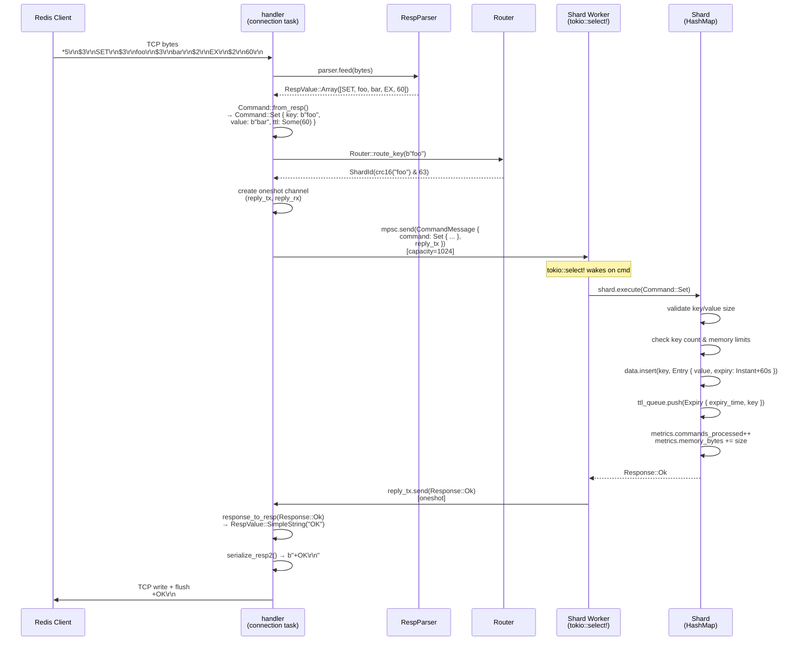
```mermaid
sequenceDiagram
    participant C as Redis Client
    participant H as handler<br/>(connection task)
    participant P as RespParser
    participant R as Router
    participant W as Shard Worker<br/>(tokio::select!)
    participant S as Shard<br/>(HashMap)

    C->>H: TCP bytes<br/>*5\r\n$3\r\nSET\r\n$3\r\nfoo\r\n$3\r\nbar\r\n$2\r\nEX\r\n$2\r\n60\r\n
    H->>P: parser.feed(bytes)
    P-->>H: RespValue::Array([SET, foo, bar, EX, 60])
    H->>H: Command::from_resp()<br/>→ Command::Set { key: b"foo",<br/>  value: b"bar", ttl: Some(60) }
    H->>R: Router::route_key(b"foo")
    R-->>H: ShardId(crc16("foo") & 63)

    H->>H: create oneshot channel<br/>(reply_tx, reply_rx)
    H->>W: mpsc.send(CommandMessage {<br/>  command: Set { ... },<br/>  reply_tx })<br/>[capacity=1024]

    Note over W: tokio::select! wakes on cmd
    W->>S: shard.execute(Command::Set)
    S->>S: validate key/value size
    S->>S: check key count & memory limits
    S->>S: data.insert(key, Entry { value, expiry: Instant+60s })
    S->>S: ttl_queue.push(Expiry { expiry_time, key })
    S->>S: metrics.commands_processed++<br/>metrics.memory_bytes += size
    S-->>W: Response::Ok

    W->>H: reply_tx.send(Response::Ok)<br/>[oneshot]
    H->>H: response_to_resp(Response::Ok)<br/>→ RespValue::SimpleString("OK")
    H->>H: serialize_resp2() → b"+OK\r\n"
    H->>C: TCP write + flush<br/>+OK\r\n
```

---

## 7. Sequence — RESP2 Parsing Pipeline

How raw TCP bytes become a typed `Command` and back to wire bytes.

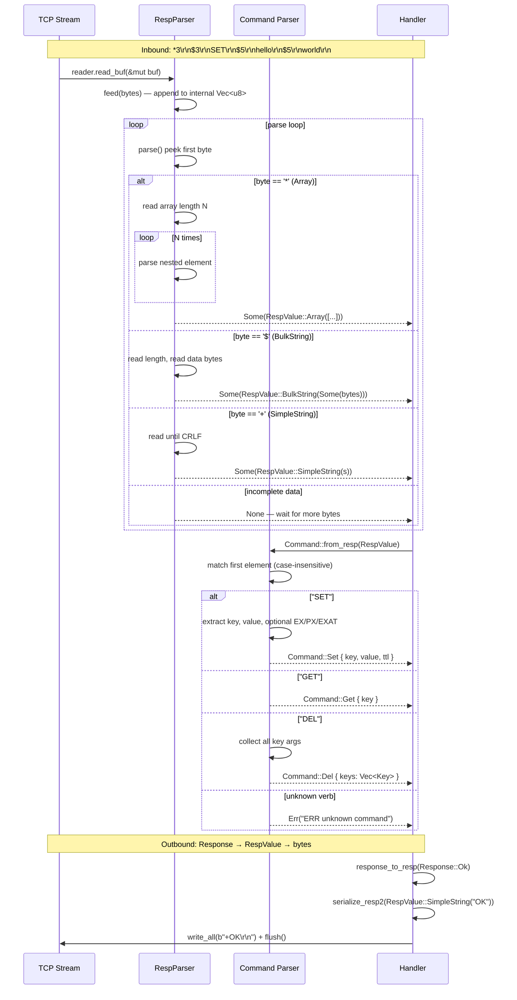
```mermaid
sequenceDiagram
    participant Net as TCP Stream
    participant P as RespParser
    participant C as Command Parser
    participant H as Handler

    Note over Net,H: Inbound: *3\r\n$3\r\nSET\r\n$5\r\nhello\r\n$5\r\nworld\r\n

    Net->>P: reader.read_buf(&mut buf)
    P->>P: feed(bytes) — append to internal Vec<u8>

    loop parse loop
        P->>P: parse() peek first byte
        alt byte == '*' (Array)
            P->>P: read array length N
            loop N times
                P->>P: parse nested element
            end
            P-->>H: Some(RespValue::Array([...]))
        else byte == '$' (BulkString)
            P->>P: read length, read data bytes
            P-->>H: Some(RespValue::BulkString(Some(bytes)))
        else byte == '+' (SimpleString)
            P->>P: read until CRLF
            P-->>H: Some(RespValue::SimpleString(s))
        else incomplete data
            P-->>H: None — wait for more bytes
        end
    end

    H->>C: Command::from_resp(RespValue)
    C->>C: match first element (case-insensitive)
    alt "SET"
        C->>C: extract key, value, optional EX/PX/EXAT
        C-->>H: Command::Set { key, value, ttl }
    else "GET"
        C-->>H: Command::Get { key }
    else "DEL"
        C->>C: collect all key args
        C-->>H: Command::Del { keys: Vec<Key> }
    else unknown verb
        C-->>H: Err("ERR unknown command")
    end

    Note over Net,H: Outbound: Response → RespValue → bytes

    H->>H: response_to_resp(Response::Ok)
    H->>H: serialize_resp2(RespValue::SimpleString("OK"))
    H->>Net: write_all(b"+OK\r\n") + flush()
```

---

## 8. Sequence — Multi-Key DEL Fan-Out

`DEL k1 k2 k3 k4 k5` where keys hash to different shards.
Demonstrates parallel scatter-gather across shards.

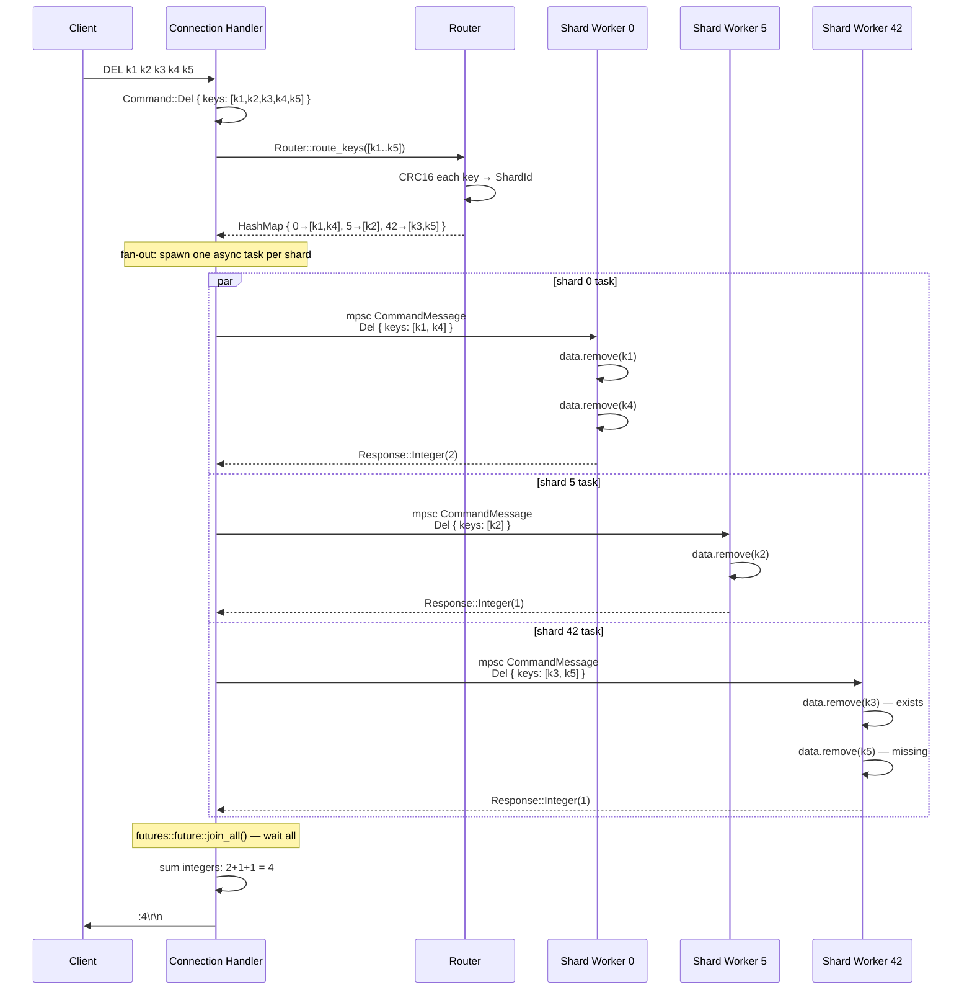
```mermaid
sequenceDiagram
    participant C  as Client
    participant H  as Connection Handler
    participant R  as Router
    participant S0 as Shard Worker 0
    participant S5 as Shard Worker 5
    participant S42 as Shard Worker 42

    C->>H: DEL k1 k2 k3 k4 k5
    H->>H: Command::Del { keys: [k1,k2,k3,k4,k5] }

    H->>R: Router::route_keys([k1..k5])
    R->>R: CRC16 each key → ShardId
    R-->>H: HashMap { 0→[k1,k4], 5→[k2], 42→[k3,k5] }

    Note over H: fan-out: spawn one async task per shard

    par shard 0 task
        H->>S0: mpsc CommandMessage<br/>Del { keys: [k1, k4] }
        S0->>S0: data.remove(k1)
        S0->>S0: data.remove(k4)
        S0-->>H: Response::Integer(2)
    and shard 5 task
        H->>S5: mpsc CommandMessage<br/>Del { keys: [k2] }
        S5->>S5: data.remove(k2)
        S5-->>H: Response::Integer(1)
    and shard 42 task
        H->>S42: mpsc CommandMessage<br/>Del { keys: [k3, k5] }
        S42->>S42: data.remove(k3) — exists
        S42->>S42: data.remove(k5) — missing
        S42-->>H: Response::Integer(1)
    end

    Note over H: futures::future::join_all() — wait all
    H->>H: sum integers: 2+1+1 = 4
    H->>C: :4\r\n
```

---

## 9. Sequence — Server Startup & Graceful Shutdown

Full lifecycle from `main()` to last snapshot flush.

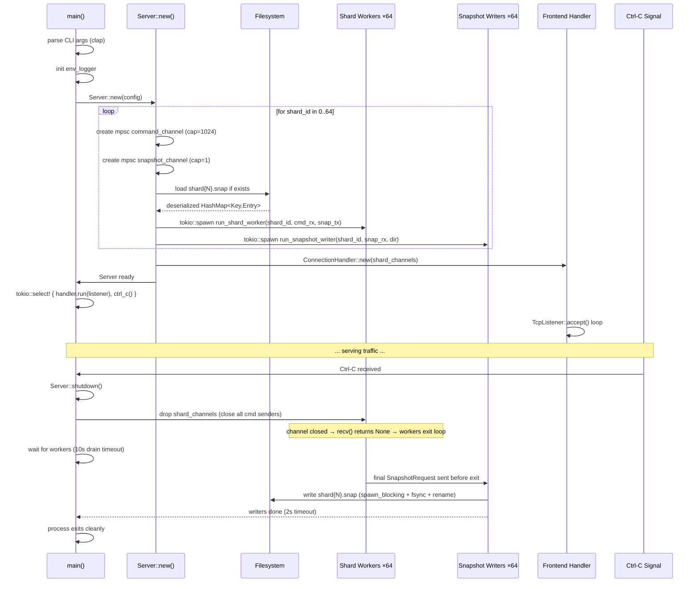
```mermaid
sequenceDiagram
    participant M  as main()
    participant S  as Server::new()
    participant FS as Filesystem
    participant SW as Shard Workers ×64
    participant WR as Snapshot Writers ×64
    participant FH as Frontend Handler
    participant SIG as Ctrl-C Signal

    M->>M: parse CLI args (clap)
    M->>M: init env_logger
    M->>S: Server::new(config)

    loop for shard_id in 0..64
        S->>S: create mpsc command_channel (cap=1024)
        S->>S: create mpsc snapshot_channel (cap=1)
        S->>FS: load shard{N}.snap if exists
        FS-->>S: deserialized HashMap<Key,Entry>
        S->>SW: tokio::spawn run_shard_worker(shard_id, cmd_rx, snap_tx)
        S->>WR: tokio::spawn run_snapshot_writer(shard_id, snap_rx, dir)
    end

    S->>FH: ConnectionHandler::new(shard_channels)
    S->>M: Server ready

    M->>M: tokio::select! { handler.run(listener), ctrl_c() }
    FH->>FH: TcpListener::accept() loop

    Note over M,SIG: ... serving traffic ...

    SIG->>M: Ctrl-C received
    M->>M: Server::shutdown()

    M->>SW: drop shard_channels (close all cmd senders)
    Note over SW: channel closed → recv() returns None → workers exit loop

    M->>M: wait for workers (10s drain timeout)
    SW->>WR: final SnapshotRequest sent before exit
    WR->>FS: write shard{N}.snap (spawn_blocking + fsync + rename)
    WR-->>M: writers done (2s timeout)

    M->>M: process exits cleanly
```

---

## 10. State — Shard Worker Event Loop

The `run_shard_worker()` tokio task cycles through three event sources
inside a single `tokio::select!`. One shard = one worker task = no shared
mutable state between shards.

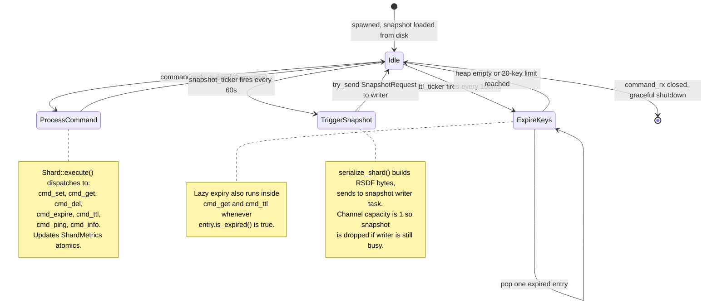
```mermaid
stateDiagram-v2
    [*] --> Idle : spawned, snapshot loaded from disk

    Idle --> ProcessCommand : command_rx.recv()
    ProcessCommand --> Idle : reply_tx.send(Response)

    Idle --> ExpireKeys : ttl_ticker fires every 100ms
    ExpireKeys --> ExpireKeys : pop one expired entry
    ExpireKeys --> Idle : heap empty or 20-key limit reached

    Idle --> TriggerSnapshot : snapshot_ticker fires every 60s
    TriggerSnapshot --> Idle : try_send SnapshotRequest to writer

    Idle --> [*] : command_rx closed, graceful shutdown

    note right of ProcessCommand
        Shard::execute() dispatches to:
        cmd_set, cmd_get, cmd_del,
        cmd_expire, cmd_ttl,
        cmd_ping, cmd_info.
        Updates ShardMetrics atomics.
    end note

    note right of ExpireKeys
        Lazy expiry also runs inside
        cmd_get and cmd_ttl whenever
        entry.is_expired() is true.
    end note

    note right of TriggerSnapshot
        serialize_shard() builds RSDF bytes,
        sends to snapshot writer task.
        Channel capacity is 1 so snapshot
        is dropped if writer is still busy.
    end note
```

---

## 11. Flowchart — TTL Expiration (Lazy + Active)

Two paths that remove expired keys. Both run entirely within a single shard —
no coordination needed.

```mermaid
flowchart TD
    subgraph lazy["Lazy Expiration (on every GET / TTL access)"]
        LA["cmd_get / cmd_ttl called"] --> LB{"entry found in HashMap?"}
        LB -->|No| LC["return nil / -2"]
        LB -->|Yes| LD{"entry.is_expired?\nInstant::now >= expiry"}
        LD -->|No| LE["return value / remaining TTL"]
        LD -->|Yes| LF["data.remove(key)"]
        LF --> LG["metrics.keys_expired++\nmetrics.key_count -= 1\nmetrics.memory_bytes -= size"]
        LG --> LH["return nil / -2"]
    end

    subgraph active["Active Expiration (every 100ms via ttl_ticker)"]
        AA["ttl_ticker fires in tokio::select!"] --> AB["call shard.expire_keys()"]
        AB --> AC{"ttl_queue.peek()"}
        AC -->|empty| AD["return, nothing to do"]
        AC -->|entry found| AE{"Instant::now >= expiry_time?"}
        AE -->|No, not yet| AD
        AE -->|Yes| AF["ttl_queue.pop()"]
        AF --> AG{"key still in HashMap?\nand same expiry?"}
        AG -->|No, already removed| AH{"checked fewer than 20?"}
        AG -->|Yes| AI["data.remove(key)"]
        AI --> AJ["metrics.keys_expired++\nmetrics.key_count -= 1\nmetrics.memory_bytes -= size"]
        AJ --> AH
        AH -->|Yes, keep going| AC
        AH -->|No, limit reached| AK["return, yield to event loop"]
    end

    style lazy fill:#e8f4e8,stroke:#4a9e4a
    style active fill:#e8e8f4,stroke:#4a4a9e
```

---

## 12. Snapshot Binary Format — RSDF

On-disk layout of a `shard{N}.snap` file. Written atomically via temp file + rename.

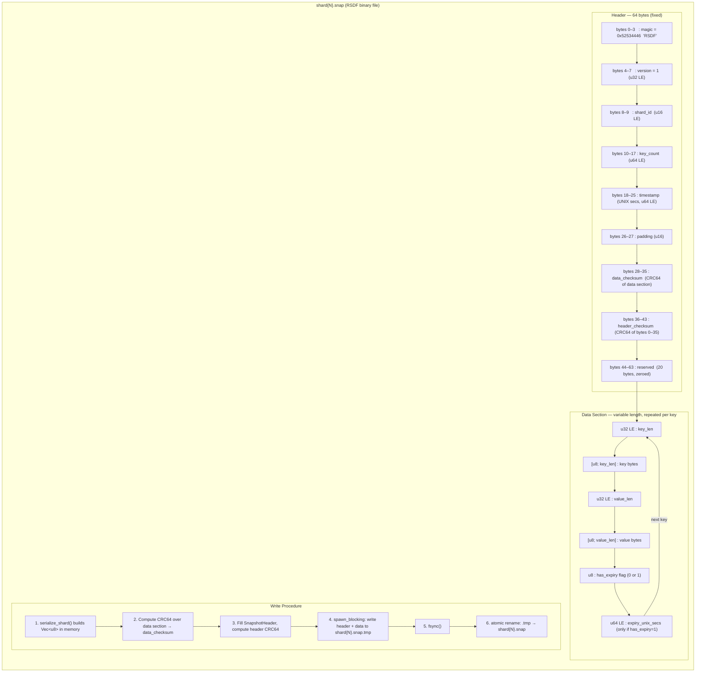
```mermaid
flowchart TD
    subgraph file["shard{N}.snap  (RSDF binary file)"]
        direction TB

        subgraph header["Header — 64 bytes (fixed)"]
            H1["bytes 0–3   : magic = 0x52534446  'RSDF'"]
            H2["bytes 4–7   : version = 1  (u32 LE)"]
            H3["bytes 8–9   : shard_id  (u16 LE)"]
            H4["bytes 10–17 : key_count  (u64 LE)"]
            H5["bytes 18–25 : timestamp  (UNIX secs, u64 LE)"]
            H6["bytes 26–27 : padding  (u16)"]
            H7["bytes 28–35 : data_checksum  (CRC64 of data section)"]
            H8["bytes 36–43 : header_checksum  (CRC64 of bytes 0–35)"]
            H9["bytes 44–63 : reserved  (20 bytes, zeroed)"]
        end

        subgraph data["Data Section — variable length, repeated per key"]
            D1["u32 LE  : key_len"]
            D2["[u8; key_len] : key bytes"]
            D3["u32 LE  : value_len"]
            D4["[u8; value_len] : value bytes"]
            D5["u8 : has_expiry flag (0 or 1)"]
            D6["u64 LE : expiry_unix_secs  (only if has_expiry=1)"]
        end

        subgraph write["Write Procedure"]
            W1["1. serialize_shard() builds Vec&lt;u8&gt; in memory"]
            W2["2. Compute CRC64 over data section → data_checksum"]
            W3["3. Fill SnapshotHeader, compute header CRC64"]
            W4["4. spawn_blocking: write header + data to shard{N}.snap.tmp"]
            W5["5. fsync()"]
            W6["6. atomic rename: .tmp → shard{N}.snap"]
        end
    end

    H1 --> H2 --> H3 --> H4 --> H5 --> H6 --> H7 --> H8 --> H9
    H9 --> D1
    D1 --> D2 --> D3 --> D4 --> D5 --> D6
    D6 -->|"next key"| D1
    W1 --> W2 --> W3 --> W4 --> W5 --> W6
```

---

## 13. Sequence — GET with Lazy Expiry

`GET key` when the key exists but may be expired. Shows the lazy-delete
path that runs inline on every read.

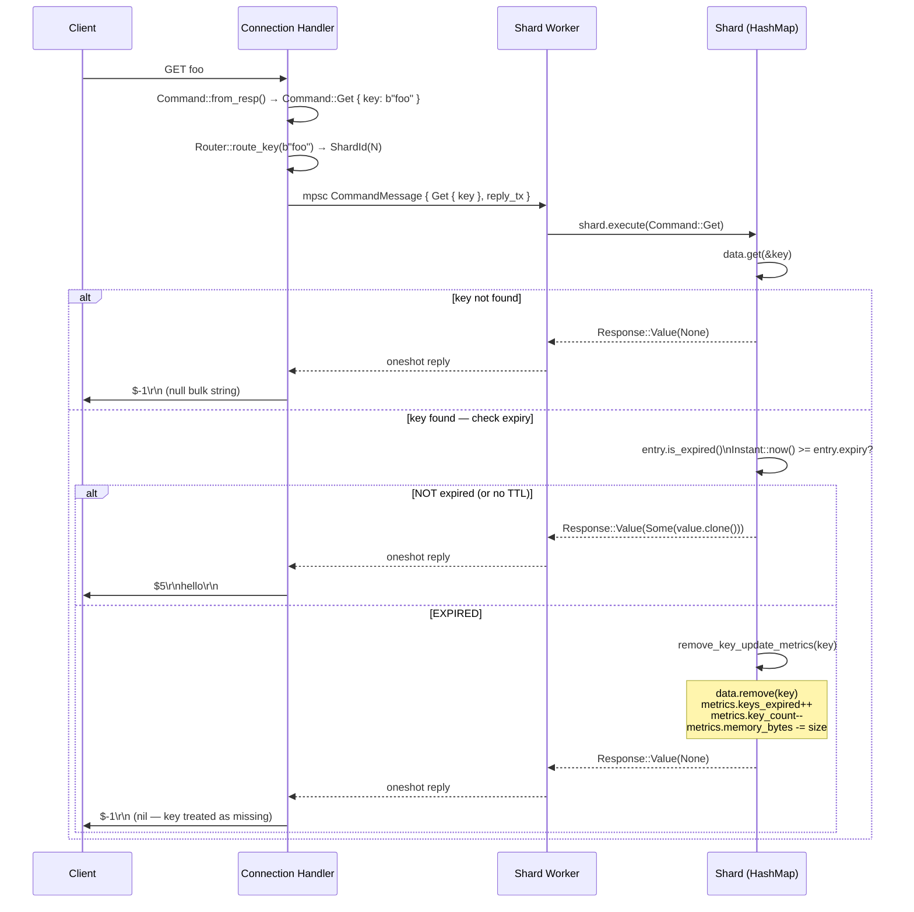
```mermaid
sequenceDiagram
    participant C  as Client
    participant H  as Connection Handler
    participant W  as Shard Worker
    participant S  as Shard (HashMap)

    C->>H: GET foo
    H->>H: Command::from_resp() → Command::Get { key: b"foo" }
    H->>H: Router::route_key(b"foo") → ShardId(N)
    H->>W: mpsc CommandMessage { Get { key }, reply_tx }

    W->>S: shard.execute(Command::Get)
    S->>S: data.get(&key)

    alt key not found
        S-->>W: Response::Value(None)
        W-->>H: oneshot reply
        H->>C: $-1\r\n  (null bulk string)
    else key found — check expiry
        S->>S: entry.is_expired()\nInstant::now() >= entry.expiry?
        alt NOT expired (or no TTL)
            S-->>W: Response::Value(Some(value.clone()))
            W-->>H: oneshot reply
            H->>C: $5\r\nhello\r\n
        else EXPIRED
            S->>S: remove_key_update_metrics(key)
            Note over S: data.remove(key)<br/>metrics.keys_expired++<br/>metrics.key_count--<br/>metrics.memory_bytes -= size
            S-->>W: Response::Value(None)
            W-->>H: oneshot reply
            H->>C: $-1\r\n  (nil — key treated as missing)
        end
    end
```

---

## 14. Flowchart — Connection Task Internals

Each accepted TCP connection spawns this structure. The reader and writer
run as independent async tasks communicating via a bounded channel.

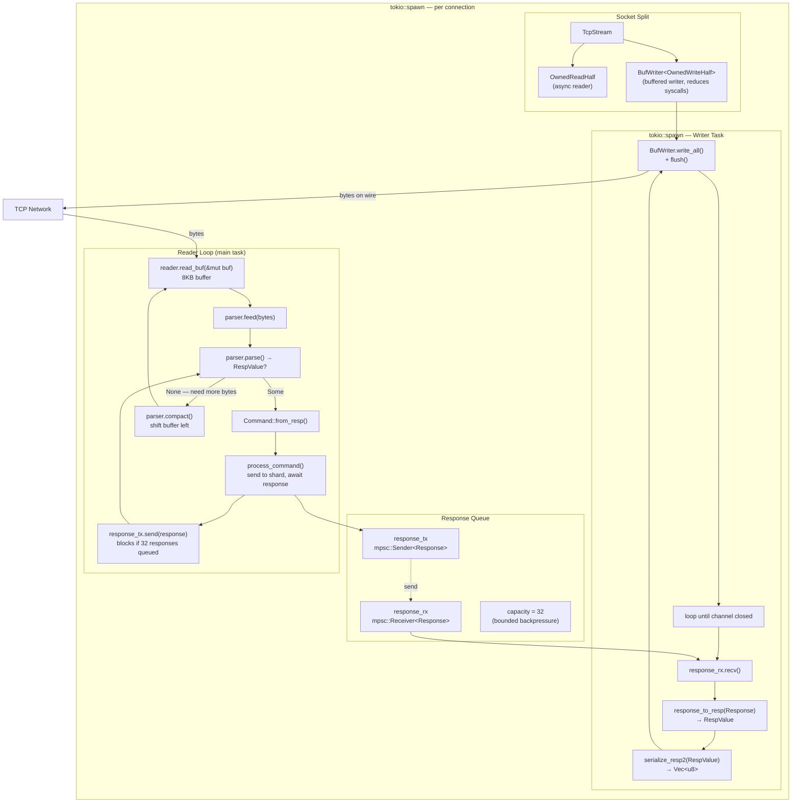
```mermaid
flowchart TB
    subgraph task["tokio::spawn — per connection"]
        direction TB

        subgraph split["Socket Split"]
            TCP["TcpStream"]
            R["OwnedReadHalf\n(async reader)"]
            BW["BufWriter&lt;OwnedWriteHalf&gt;\n(buffered writer, reduces syscalls)"]
            TCP --> R & BW
        end

        subgraph rchan["Response Queue"]
            RTX["response_tx\nmpsc::Sender&lt;Response&gt;"]
            RRX["response_rx\nmpsc::Receiver&lt;Response&gt;"]
            CAP["capacity = 32\n(bounded backpressure)"]
            RTX -. "send" .-> RRX
        end

        subgraph writer_task["tokio::spawn — Writer Task"]
            W1["response_rx.recv()"]
            W2["response_to_resp(Response)\n→ RespValue"]
            W3["serialize_resp2(RespValue)\n→ Vec&lt;u8&gt;"]
            W4["BufWriter.write_all()\n+ flush()"]
            W5["loop until channel closed"]
            W1 --> W2 --> W3 --> W4 --> W5 --> W1
        end

        subgraph reader_loop["Reader Loop (main task)"]
            RL1["reader.read_buf(&mut buf)\n8KB buffer"]
            RL2["parser.feed(bytes)"]
            RL3["parser.parse() → RespValue?"]
            RL4["Command::from_resp()"]
            RL5["process_command()\nsend to shard, await response"]
            RL6["response_tx.send(response)\nblocks if 32 responses queued"]
            RL7["parser.compact()\nshift buffer left"]
            RL1 --> RL2 --> RL3 -->|Some| RL4 --> RL5 --> RL6 --> RL3
            RL3 -->|None — need more bytes| RL7 --> RL1
        end
    end

    RRX --> W1
    RL5 --> RTX
    BW --> W4
    W4 -->|"bytes on wire"| NET["TCP Network"]
    NET -->|"bytes"| RL1
```

---

## 15. Flowchart — Error Propagation Paths

All error paths from network edge to client response, including
shard timeouts and partial multi-key failures.

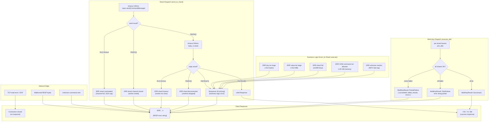
```mermaid
flowchart TD
    subgraph net["Network Edge"]
        N1["TCP read error / EOF"]
        N2["Malformed RESP bytes"]
        N3["Unknown command verb"]
    end

    subgraph dispatch["Shard Dispatch (send_to_shard)"]
        D1["timeout 100ms:\nmpsc.send(CommandMessage)"]
        D2{"send result?"}
        D3["ERR shard overloaded\n(channel full, 1024 cap)"]
        D4["ERR shard channel closed\n(worker exited)"]
        D5["timeout 500ms:\nreply_rx.await"]
        D6{"reply result?"}
        D7["ERR shard timeout\n(worker too slow)"]
        D8["ERR shard disconnected\n(oneshot dropped)"]
        D9["Response::Error(msg)\n(business logic error)"]
        D10["valid Response"]
    end

    subgraph multikey["Multi-Key Dispatch (execute_del)"]
        M1["per-shard futures\njoin_all()"]
        M2{"all shards OK?"}
        M3["MultiKeyResult::Success(n)"]
        M4["MultiKeyResult::PartialFailure\n{ succeeded, failed_shards, errors }"]
        M5["MultiKeyResult::TotalFailure\nerror string joined"]
    end

    subgraph biz["Business Logic Errors (in Shard::execute)"]
        B1["ERR key too large\n(>512 bytes)"]
        B2["ERR value too large\n(>512 MB)"]
        B3["ERR shard full\n(≥100M keys)"]
        B4["ERR OOM command not allowed\n(>20 GB memory)"]
        B5["ERR unknown section\n(INFO bad arg)"]
    end

    subgraph client["Client Response"]
        C1["Connection closed\n(no response)"]
        C2["-ERR ...\r\n\n(RESP error string)"]
        C3["+OK / :N / $N\n(success response)"]
    end

    N1 --> C1
    N2 --> C2
    N3 --> C2
    D1 --> D2
    D2 -->|"Err() timeout"| D3 --> C2
    D2 -->|"Ok(Err())"| D4 --> C2
    D2 -->|"Ok(Ok())"| D5 --> D6
    D6 -->|"Err() timeout"| D7 --> C2
    D6 -->|"Ok(Err())"| D8 --> C2
    D6 -->|"Ok(Ok(err))"| D9 --> C2
    D6 -->|"Ok(Ok(val))"| D10 --> C3
    M1 --> M2
    M2 -->|all ok| M3 --> C3
    M2 -->|some failed| M4 --> C2
    M2 -->|all failed| M5 --> C2
    B1 & B2 & B3 & B4 & B5 --> D9
```

---

## 16. Flowchart — Memory Accounting per SET

Delta-based memory tracking ensures overwrites don't double-count.
All updates use `Ordering::Relaxed` atomics — no locks needed.

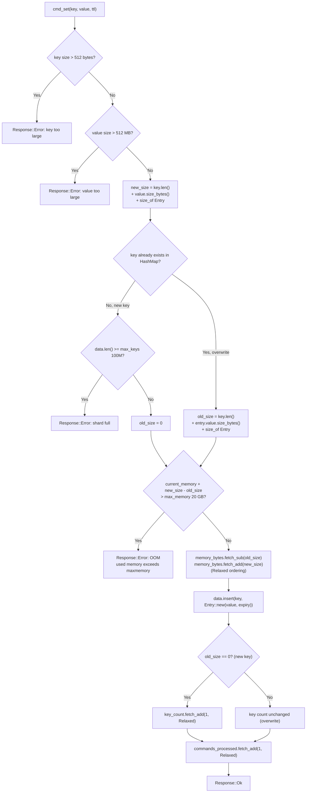
```mermaid
flowchart TD
    A["cmd_set(key, value, ttl)"] --> B{"key size > 512 bytes?"}
    B -->|Yes| ERR1["Response::Error: key too large"]
    B -->|No| C{"value size > 512 MB?"}
    C -->|Yes| ERR2["Response::Error: value too large"]
    C -->|No| I["new_size = key.len()\n+ value.size_bytes()\n+ size_of Entry"]

    I --> D{"key already exists in HashMap?"}

    D -->|No, new key| E{"data.len() >= max_keys 100M?"}
    E -->|Yes| ERR3["Response::Error: shard full"]
    E -->|No| F["old_size = 0"]

    D -->|Yes, overwrite| G["old_size = key.len()\n+ entry.value.size_bytes()\n+ size_of Entry"]

    F --> J{"current_memory + new_size - old_size\n> max_memory 20 GB?"}
    G --> J

    J -->|Yes| ERR4["Response::Error: OOM\nused memory exceeds maxmemory"]
    J -->|No| K["memory_bytes.fetch_sub(old_size)\nmemory_bytes.fetch_add(new_size)\n(Relaxed ordering)"]

    K --> L["data.insert(key, Entry::new(value, expiry))"]
    L --> M{"old_size == 0? (new key)"}
    M -->|Yes| N["key_count.fetch_add(1, Relaxed)"]
    M -->|No| O["key count unchanged (overwrite)"]
    N --> P["commands_processed.fetch_add(1, Relaxed)"]
    O --> P
    P --> Q["Response::Ok"]
```

---

## 17. Sequence — Snapshot Load on Startup

How a shard's persisted state is deserialized from disk and validated
before the shard worker starts accepting commands.

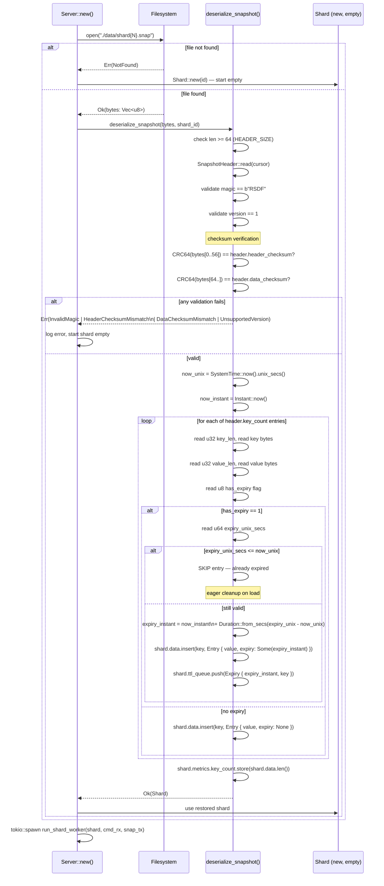
```mermaid
sequenceDiagram
    participant SV as Server::new()
    participant FS as Filesystem
    participant DS as deserialize_snapshot()
    participant SH as Shard (new, empty)

    SV->>FS: open("./data/shard{N}.snap")
    alt file not found
        FS-->>SV: Err(NotFound)
        SV->>SH: Shard::new(id) — start empty
    else file found
        FS-->>SV: Ok(bytes: Vec<u8>)
        SV->>DS: deserialize_snapshot(bytes, shard_id)

        DS->>DS: check len >= 64 (HEADER_SIZE)
        DS->>DS: SnapshotHeader::read(cursor)
        DS->>DS: validate magic == b"RSDF"
        DS->>DS: validate version == 1

        Note over DS: checksum verification
        DS->>DS: CRC64(bytes[0..56]) == header.header_checksum?
        DS->>DS: CRC64(bytes[64..]) == header.data_checksum?

        alt any validation fails
            DS-->>SV: Err(InvalidMagic | HeaderChecksumMismatch\n| DataChecksumMismatch | UnsupportedVersion)
            SV->>SV: log error, start shard empty
        else valid
            DS->>DS: now_unix = SystemTime::now().unix_secs()
            DS->>DS: now_instant = Instant::now()

            loop for each of header.key_count entries
                DS->>DS: read u32 key_len, read key bytes
                DS->>DS: read u32 value_len, read value bytes
                DS->>DS: read u8 has_expiry flag
                alt has_expiry == 1
                    DS->>DS: read u64 expiry_unix_secs
                    alt expiry_unix_secs <= now_unix
                        DS->>DS: SKIP entry — already expired
                        Note over DS: eager cleanup on load
                    else still valid
                        DS->>DS: expiry_instant = now_instant\n+ Duration::from_secs(expiry_unix - now_unix)
                        DS->>DS: shard.data.insert(key, Entry { value, expiry: Some(expiry_instant) })
                        DS->>DS: shard.ttl_queue.push(Expiry { expiry_instant, key })
                    end
                else no expiry
                    DS->>DS: shard.data.insert(key, Entry { value, expiry: None })
                end
            end

            DS->>DS: shard.metrics.key_count.store(shard.data.len())
            DS-->>SV: Ok(Shard)
            SV->>SH: use restored shard
        end
    end

    SV->>SV: tokio::spawn run_shard_worker(shard, cmd_rx, snap_tx)
```

---

## 18. Flowchart — Backpressure Cascade

How bounded channels at every layer create flow control from shard
back to the client. Three choke points, three different consequences.

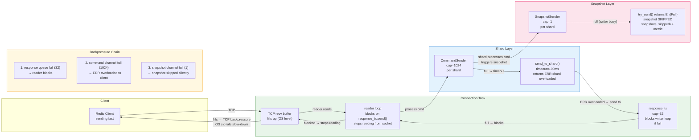
```mermaid
flowchart LR
    subgraph client["Client"]
        C["Redis Client\nsending fast"]
    end

    subgraph conn["Connection Task"]
        RT["response_tx\ncap=32\nblocks writer loop\nif full"]
        RL["reader loop\nblocks on response_tx.send()\nstops reading from socket"]
        BUF["TCP recv buffer\nfills up (OS level)"]
    end

    subgraph shard["Shard Layer"]
        SC["CommandSender\ncap=1024\nper shard"]
        ST["send_to_shard()\ntimeout=100ms\nreturns ERR shard overloaded"]
    end

    subgraph snap["Snapshot Layer"]
        SS["SnapshotSender\ncap=1\nper shard"]
        SK["try_send() returns Err(Full)\nsnapshot SKIPPED\nsnapshots_skipped++ metric"]
    end

    C -->|"TCP"| BUF
    BUF -->|"reader reads"| RL
    RL -->|"process cmd"| SC
    SC -->|"full → timeout"| ST
    ST -->|"ERR overloaded → send to"| RT
    RT -->|"full → blocks"| RL
    RL -->|"blocked → stops reading"| BUF
    BUF -->|"fills → TCP backpressure\nOS signals slow-down"| C

    SC -->|"shard processes cmd\ntriggers snapshot"| SS
    SS -->|"full (writer busy)"| SK

    subgraph legend["Backpressure Chain"]
        L1["1. response queue full (32)\n   → reader blocks"]
        L2["2. command channel full (1024)\n   → ERR overloaded to client"]
        L3["3. snapshot channel full (1)\n   → snapshot skipped silently"]
    end

    style legend fill:#fff8e1,stroke:#f9a825
    style snap fill:#fce4ec,stroke:#e91e63
    style shard fill:#e3f2fd,stroke:#1976d2
    style conn fill:#e8f5e9,stroke:#388e3c
```

---

## 19. Flowchart — Metrics Aggregation to Prometheus

How per-shard atomic counters flow through aggregation to the HTTP
`/metrics` endpoint scraped by Prometheus.

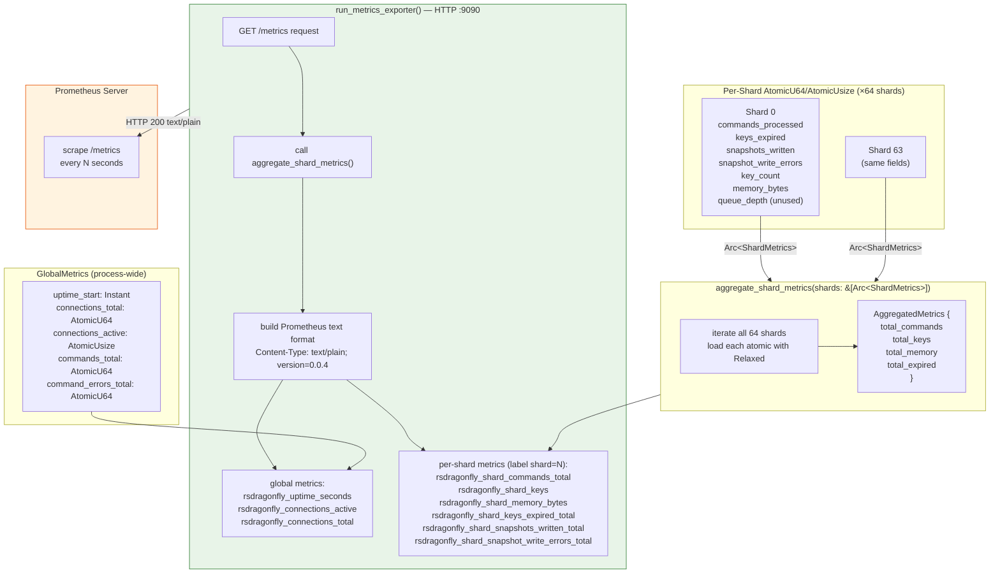
```mermaid
flowchart TB
    subgraph shardmetrics["Per-Shard AtomicU64/AtomicUsize (×64 shards)"]
        direction LR
        SM0["Shard 0\ncommands_processed\nkeys_expired\nsnapshots_written\nsnapshot_write_errors\nkey_count\nmemory_bytes\nqueue_depth (unused)"]
        SMN["Shard 63\n(same fields)"]
    end

    subgraph global["GlobalMetrics (process-wide)"]
        GM["uptime_start: Instant\nconnections_total: AtomicU64\nconnections_active: AtomicUsize\ncommands_total: AtomicU64\ncommand_errors_total: AtomicU64"]
    end

    subgraph agg["aggregate_shard_metrics(shards: &[Arc&lt;ShardMetrics&gt;])"]
        A1["iterate all 64 shards\nload each atomic with Relaxed"]
        A2["AggregatedMetrics {\n  total_commands\n  total_keys\n  total_memory\n  total_expired\n}"]
        A1 --> A2
    end

    subgraph exporter["run_metrics_exporter() — HTTP :9090"]
        E1["GET /metrics request"]
        E2["call aggregate_shard_metrics()"]
        E3["build Prometheus text format\nContent-Type: text/plain; version=0.0.4"]
        E4["global metrics:\nrsdragonfly_uptime_seconds\nrsdragonfly_connections_active\nrsdragonfly_connections_total"]
        E5["per-shard metrics (label shard=N):\nrsdragonfly_shard_commands_total\nrsdragonfly_shard_keys\nrsdragonfly_shard_memory_bytes\nrsdragonfly_shard_keys_expired_total\nrsdragonfly_shard_snapshots_written_total\nrsdragonfly_shard_snapshot_write_errors_total"]
        E1 --> E2 --> E3
        E3 --> E4 & E5
    end

    subgraph prometheus["Prometheus Server"]
        P["scrape /metrics\nevery N seconds"]
    end

    SM0 & SMN -->|"Arc&lt;ShardMetrics&gt;"| agg
    GM --> E4
    agg --> E5
    exporter -->|"HTTP 200 text/plain"| P

    style exporter fill:#e8f4e8,stroke:#2e7d32
    style prometheus fill:#fff3e0,stroke:#e65100
```

---

## 20. Flowchart — Module Dependency Graph

Which modules depend on which. Arrows point from dependent → dependency.
`common/` is the only module with no internal dependencies.

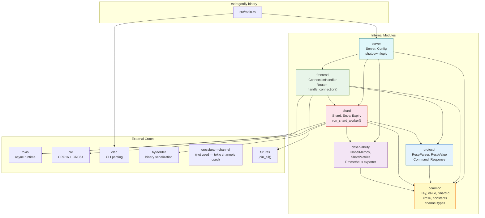
```mermaid
flowchart TB
    subgraph binary["rsdragonfly binary"]
        MAIN["src/main.rs"]
    end

    subgraph modules["Internal Modules"]
        SERVER["server\nServer, Config\nshutdown logic"]
        FRONTEND["frontend\nConnectionHandler\nRouter, handle_connection()"]
        PROTOCOL["protocol\nRespParser, RespValue\nCommand, Response"]
        SHARD["shard\nShard, Entry, Expiry\nrun_shard_worker()"]
        OBS["observability\nGlobalMetrics, ShardMetrics\nPrometheus exporter"]
        COMMON["common\nKey, Value, ShardId\ncrc16, constants\nchannel types"]
    end

    MAIN --> SERVER
    SERVER --> FRONTEND
    SERVER --> SHARD
    SERVER --> OBS
    SERVER --> COMMON

    FRONTEND --> PROTOCOL
    FRONTEND --> SHARD
    FRONTEND --> COMMON

    PROTOCOL --> COMMON

    SHARD --> PROTOCOL
    SHARD --> OBS
    SHARD --> COMMON

    OBS --> COMMON

    subgraph external["External Crates"]
        TOKIO["tokio\nasync runtime"]
        CRC["crc\nCRC16 + CRC64"]
        CLAP["clap\nCLI parsing"]
        BYTEORDER["byteorder\nbinary serialization"]
        CROSSBEAM["crossbeam-channel\n(not used — tokio channels used)"]
        FUTURES["futures\njoin_all()"]
    end

    FRONTEND --> TOKIO
    SHARD --> TOKIO
    SHARD --> CRC
    SHARD --> BYTEORDER
    FRONTEND --> FUTURES
    MAIN --> CLAP

    style COMMON fill:#fff9c4,stroke:#f57f17
    style PROTOCOL fill:#e3f2fd,stroke:#1565c0
    style SHARD fill:#fce4ec,stroke:#c62828
    style FRONTEND fill:#e8f5e9,stroke:#1b5e20
    style OBS fill:#f3e5f5,stroke:#6a1b9a
    style SERVER fill:#e0f7fa,stroke:#006064
```
